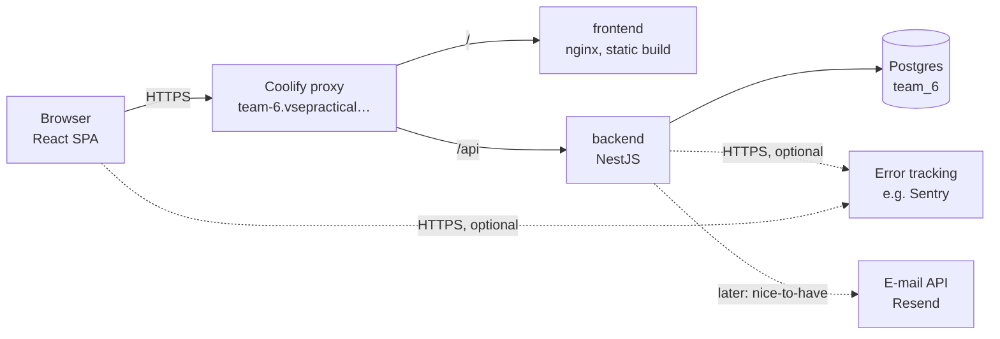
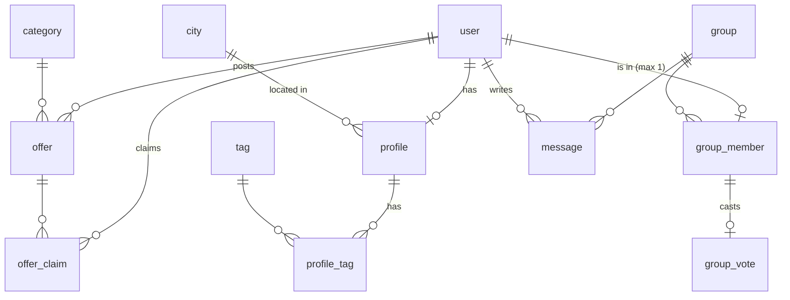

# Kvintet — architecture

How the Kvintet pilot is built, and why. The stack is given by the course: NestJS + Prisma + Postgres on the backend, React + Vite + TanStack Router/Query + shadcn/ui on the frontend, BetterAuth for authentication. The example code in the repo (quacks) is only a placeholder and does not constrain this design. It covers the MVP backlog (issues #3–#24). Read it before starting a story. When a decision here changes, update this file in the same PR.

## 1. Context and constraints

**What we build:** A web app for a ~1-month pilot with a few hundred students. Users fill in a profile. They join or start a _proposal_ (a forming group of up to 5 people), and the proposal becomes an active _kvintet_. Members chat with each other. There is also a board of offers with limited spots, and an admin sees aggregated pilot numbers.

**Infrastructure we have:**

| Thing    | What it is                                                                                                                       |
| -------- | -------------------------------------------------------------------------------------------------------------------------------- |
| App      | `https://team-6.vsepractical.applifting.dev`. Coolify runs two containers: `frontend` (nginx, static SPA) and `backend` (NestJS) |
| Routing  | Same origin. `/` goes to the frontend and `/api` to the backend, so auth cookies are first-party                                 |
| Database | One Postgres (`team_6`), reachable through Adminer at `db.vsepractical.applifting.dev`                                           |
| Logs     | `logs.vsepractical.applifting.dev` (read-only, shared, no alerts)                                                                |
| Deploy   | Push to `main` → GitHub Action builds both images → Coolify webhook. Backend runs `prisma migrate deploy` on start               |
| CI       | `ci.yml` on every PR: format, lint, type-check, tests, build                                                                     |

**What we don't have, and what follows from it:**

| Missing                                  | Consequence for the design                                                                                          |
| ---------------------------------------- | ------------------------------------------------------------------------------------------------------------------- |
| Staging (`main` = production)            | Small PRs, green CI before merge, backwards-compatible migrations only, no demo data in the DB                      |
| Cron / worker                            | Time-based state is computed **when read**, never by a scheduled job                                                |
| Known instance count, persistent disk    | Backend is **stateless**. Everything lives in Postgres: no in-memory locks, caches or uploaded files on disk        |
| Reliable WebSocket/SSE through the proxy | **Polling** for chat and group status                                                                               |
| DNS / outbound e-mail in MVP             | No e-mail in MVP. Later, send through a provider with an HTTPS API (e.g. Resend) behind an `EmailService` interface |
| Coolify access for runtime env vars      | New backend secrets need the course admins (see Open questions)                                                     |
| Backups we control                       | Export through Adminer before risky migrations                                                                      |

**Load estimate:** ≤ 500 users, tens of them online at peak. The data is tiny: thousands of rows, with chat messages being the largest table. One backend container and one Postgres are more than enough. The only recurring load is polling: 50 people with chat open × 1 request / 5 s ≈ 10 req/s.

## 2. High-level design

A **modular monolith**: one NestJS backend split into feature modules, one React SPA, one Postgres.



### Design principles

1. **The server owns every rule.** This includes capacity, the 5-member cap, voting, who may see what, and anonymity in the feed. The frontend only displays and validates for convenience. This also keeps a future mobile client (Capacitor or React Native) cheap.
2. **Invariants live in the database.** Use unique constraints, foreign keys with cascades, and transactions with row locks. Never rely on in-process state.
3. **Derive, don't schedule.** "Offer is full / past", "proposal is suitable for me" and "kvintet is formed" are computed from current rows in the request that reads them.
4. **Privacy by construction.** The anonymous feed is a separate DTO without name fields. Admin endpoints return only aggregates. Message bodies and e-mails are never logged.
5. **One layering everywhere.** Each backend module has a controller with DTOs, then a service, a repository, and a domain type; only the repository touches Prisma. On the frontend, each feature has `api/` (zod schema + query options), `hooks/` and `components/`.

## 3. Backend

### Modules

| Module (`src/modules/…`) | Responsibility                                                               | Issues             |
| ------------------------ | ---------------------------------------------------------------------------- | ------------------ |
| `account`                | Code of conduct consent at sign-up, account deletion                         | #5, #19            |
| `profile`                | Profile, questionnaire, availability, location, onboarding status            | #7, #8, #9         |
| `reference`              | Read-only reference data: tags, categories, cities                           | #7, #8, #11        |
| `board`                  | Offers, category filter, claiming/releasing spots                            | #10, #11, #12      |
| `kvintet`                | Groups (proposal → active), membership, votes, feed, leaving                 | #13, #15, #16, #18 |
| `matching`               | **Pure** scoring functions, no DB access, used by `kvintet` to rank the feed | #14                |
| `chat`                   | Group messages, cursor-based polling                                         | #17                |
| `admin`                  | Aggregated pilot statistics                                                  | #20, #21           |

Shared (`src/shared/…`):

- **Auth:** BetterAuth with e-mail + password, sessions stored in Postgres. Guards: `AuthenticatedUserGuard` (signed in), `OnboardedGuard` (finished profile; feed, joining), `AdminGuard` (`role === 'admin'`).
- **Errors:** A global exception filter returns `{ code, message }`. `code` is a stable key that the frontend translates (#4).
- **Monitoring:** The error-tracking SDK and the filter hook live here (#24).

### Data model

Application tables next to BetterAuth's own (`user`, `session`, `account`, `verification`):



| Table          | Key columns                                                                                                                               | Constraints / notes                                                                                       |
| -------------- | ----------------------------------------------------------------------------------------------------------------------------------------- | --------------------------------------------------------------------------------------------------------- |
| `user` (+)     | `role` (`user` / `admin`), `codeOfConductAcceptedAt`, `codeOfConductVersion`                                                              | Consent stored at sign-up through a BetterAuth additional field and hook                                  |
| `profile`      | `userId` PK, `position`, `expectations`, `meetingFrequency` (enum), `weekdays`, `weekends`, `cityId`, `radiusKm`, `onboardingCompletedAt` | `onboardingCompletedAt IS NULL` means the user goes to onboarding                                         |
| `tag`          | `id`, `slug`                                                                                                                              | Reference data                                                                                            |
| `profile_tag`  | `userId`, `tagId`, `kind` (`TEACH` / `LEARN` / `INTEREST`)                                                                                | PK (`userId`, `tagId`, `kind`)                                                                            |
| `city`         | `id`, `name`, `lat`, `lng`                                                                                                                | Reference data. Distance is computed with the haversine formula in the matching module                    |
| `category`     | `id`, `slug`, `sortOrder`, `hidden`                                                                                                       | Reference data                                                                                            |
| `offer`        | `id`, `authorId`, `title`, `description`, `place`, `startsAt`, `capacity`, `categoryId`                                                   | Index (`categoryId`, `startsAt`). `CHECK capacity >= 1`                                                   |
| `offer_claim`  | `offerId`, `userId`, `createdAt`                                                                                                          | PK (`offerId`, `userId`) prevents double claims                                                           |
| `group`        | `id`, `status` (`FORMING` / `ACTIVE`), `createdAt`, `activatedAt`                                                                         | A proposal is a `FORMING` group                                                                           |
| `group_member` | `groupId`, `userId`, `joinedAt`                                                                                                           | PK (`groupId`, `userId`) and **unique `userId`**, so a user is in at most one group. Row deleted on leave |
| `group_vote`   | `groupId`, `userId`, `createdAt`                                                                                                          | FK to `group_member` with `ON DELETE CASCADE`, so the vote disappears when the member leaves              |
| `message`      | `id`, `groupId`, `authorId?`, `kind` (`USER` / `SYSTEM`), `body`, `createdAt`                                                             | Index (`groupId`, `createdAt`). `authorId` is set to NULL when the account is deleted (open question #19) |

**Reference data** (tags, categories, cities) is inserted by **migrations** (`INSERT … ON CONFLICT DO NOTHING`). That way they reach production through the normal deploy (`migrate deploy`). A seed script is only for local demo users and must never run against production.

**Admin account (#20):** `user.role` is an enum (`user` / `admin`, default `user`) that users cannot set through the API. The admin registers normally, and then someone sets `role = 'admin'` via Adminer. This is a one-line runbook step with no code and no secret.

### Critical flows

All of these run in a single Prisma `$transaction`. The parent row is locked with `SELECT … FOR UPDATE` through `$queryRaw` so that two requests cannot both take the last spot.

**Claim a spot (#12)**

```
BEGIN
  SELECT … FROM offer WHERE id = $1 FOR UPDATE
  reject if startsAt <= now()
  reject if (SELECT count(*) FROM offer_claim WHERE offerId = $1) >= capacity
  INSERT offer_claim            -- PK rejects a second claim by the same user
COMMIT
```

**Join a proposal (#13)**

```
BEGIN
  SELECT … FROM "group" WHERE id = $1 FOR UPDATE
  reject unless status = FORMING and member count < 5
  INSERT group_member           -- unique userId rejects "already in a group"
  if member count = 5 → status = ACTIVE, activatedAt = now()
COMMIT
```

Starting a proposal inserts a new `FORMING` group and the caller's membership in one transaction.

**Vote (#15)**

```
BEGIN
  lock the group row
  reject unless status = FORMING and 3 <= member count <= 4
  INSERT group_vote
  if vote count = member count → status = ACTIVE
COMMIT
```

There is no "no" vote. A member who joins after voting started has no vote row yet, so unanimity holds by construction.

**Leave (#18):** Delete the `group_member` row, which removes the vote through the cascade. Insert a `SYSTEM` message saying the member left. Delete the group if it becomes empty. The behaviour of an `ACTIVE` group below 3 members is an open question.

**Board listing (#10–#12):** `WHERE startsAt > now() AND claimCount < capacity`, filtered by category. "Full" and "past" are never stored. When someone releases a spot, the offer shows on the board again automatically.

### Matching (#14)

`matching` is a set of pure functions, so it can be unit-tested with fixed fixtures:

```ts
scoreMember(me: MatchProfile, other: MatchProfile): number
scoreGroup(me: MatchProfile, members: MatchProfile[]): number  // e.g. mean of member scores
isEligible(me, members): boolean                              // hard filters: distance within radius, availability overlap
```

Starting signals (weights are an open question, so keep them in one constant):

- **Complementarity:** what I want to learn ∩ what they can teach, and vice versa.
- **Shared interests:** Jaccard similarity of `INTEREST` tags.
- **Questionnaire fit:** same meeting frequency.
- **Availability overlap:** weekdays/weekends. **Location:** distance ≤ both radii.

**When it runs:** `GET /api/kvintets/feed` loads the caller's profile and every `FORMING` group with < 5 members and its members' profiles. It then filters by `isEligible`, scores, drops results under the threshold and sorts. At pilot scale (≤ ~100 open groups × ≤ 4 members) this takes milliseconds. Nothing is precomputed, so profile edits (#9) apply on the next load.

**Feed privacy (#13):** The response type is `ProposalCardDto { id, memberCount, members: { position, tags }[] }`. It has no `name`, `email` or `userId`. A controller test asserts that these fields are absent.

### API sketch

All routes are under `/api`, need a session unless marked public, and are documented in Swagger.

| Method & path                        | Purpose                             | Guard     |
| ------------------------------------ | ----------------------------------- | --------- |
| `GET /reference`                     | Tags, categories, cities            | public    |
| `GET/PUT /me/profile`                | Read / save profile + questionnaire | auth      |
| `DELETE /me`                         | Delete account                      | auth      |
| `GET /offers?category=`              | Board listing                       | auth      |
| `POST /offers`                       | Post an offer                       | auth      |
| `POST/DELETE /offers/:id/claim`      | Claim / release a spot              | auth      |
| `GET /kvintets/feed`                 | Ranked proposals                    | onboarded |
| `POST /kvintets`                     | Start a proposal                    | onboarded |
| `POST /kvintets/:id/members`         | Join                                | onboarded |
| `GET /kvintets/mine`                 | My group, members and vote status   | auth      |
| `POST /kvintets/mine/vote`           | Vote to start                       | member    |
| `DELETE /kvintets/mine/membership`   | Leave                               | member    |
| `GET /kvintets/mine/messages?after=` | Messages after a cursor             | member    |
| `POST /kvintets/mine/messages`       | Send a message                      | member    |
| `GET /admin/stats`                   | Aggregated numbers                  | admin     |

Using `mine` instead of `:id` for member-only routes means a client cannot address someone else's group. Membership is derived from the session.

## 4. Frontend

**Routes** (TanStack Router, file-based):

| Route                                        | Access                   | Notes                                                  |
| -------------------------------------------- | ------------------------ | ------------------------------------------------------ |
| `/`, `/login`, `/signup`, `/code-of-conduct` | public                   | Code of conduct is linked from the footer              |
| `/onboarding`                                | signed in, not onboarded |                                                        |
| `/overview`                                  | signed in + onboarded    | Hub: my kvintet status, my claimed offers, next action |
| `/profile`                                   | signed in + onboarded    | Edit profile and delete account                        |
| `/board`, `/board/new`                       | signed in + onboarded    | Category filter lives in the URL search params         |
| `/kvintet/feed`, `/kvintet`                  | signed in + onboarded    | Feed / my kvintet with vote and chat                   |
| `/admin`                                     | admin                    |                                                        |

Guards are pathless layout routes (`_Authenticated`, `_Onboarded`, `_Admin`) whose loader checks the session and redirects. An `_Onboarded` layout redirects to `/onboarding`, and an `_Admin` layout shows the 404 page for non-admins.

**Features:** `src/features/{account,profile,board,kvintet,chat,admin,legal}`, each with `api/` (zod schemas, query keys, query options), `hooks/` (mutations, invalidation) and `components/`. Business decisions stay in hooks and on the server, not in components.

**Polling:** chat messages `refetchInterval: 5000`, my kvintet (vote status) `refetchInterval: 10000`. Both use `refetchIntervalInBackground: false`, so hidden tabs don't poll. Chat sends `after=<last message id>` and appends the result.

**i18n (#4):** `i18next` + `react-i18next`. Czech JSON per feature namespace. Backend error `code`s map to keys. i18next also works in React Native, so a future mobile client can reuse the translations.

**Design (#3):** Tokens in `src/styles/global.css`. The serif font and logo are self-hosted under `public/`, with no CDN. Everything follows `DESIGN.md`.

## 5. Cross-cutting concerns

**Security & GDPR**

- BetterAuth session cookies on the same origin. Every guard runs on the server.
- Collect only the data matching needs. There are no photos.
- Account deletion cascades.
- Never log e-mails, names or message bodies, because the logs are shared across the course.
- Error tracking scrubs request bodies and user identifiers.

**Testing**

- Unit tests for services and especially `matching`.
- Concurrency-critical repositories (claim, join, vote) need **integration tests against a real Postgres**. Add a `postgres` service container to `ci.yml`, and never point tests at the production DB.

**Migrations without staging**

- Only additive, backwards-compatible migrations in a single deploy.
- Renames and drops are done in two steps across two deploys.
- Before a migration that touches existing data, export the DB in Adminer.

**Monitoring (#24)**

- Backend: exception filter + SDK.
- Frontend: error boundary + SDK.
- Alerts by e-mail from the tracking service.
- Fallback without runtime env access: an `error_log` table plus a periodic manual check.

**Release flow**

- Feature branch → PR → CI green → review → merge to `main`, which deploys to production.
- Unfinished features stay unmerged or hidden from navigation. We don't need a feature-flag system for a one-month pilot.

**Mobile later:** The REST API is the only interface and the rules sit on the server, so the cheap path is Capacitor wrapping the SPA, and React Native stays possible.

## 6. Trade-offs

| Decision                                | Chosen                                    | Alternative                        | Why                                                                                                    |
| --------------------------------------- | ----------------------------------------- | ---------------------------------- | ------------------------------------------------------------------------------------------------------ |
| Service shape                           | Modular monolith                          | Microservices                      | One container slot, one DB, a small team, one month                                                    |
| Live chat                               | Polling every 5 s                         | WebSocket / SSE                    | Unknown proxy support. The client accepts a short delay. Easy to swap later behind the same query hook |
| Time-based state (full / past offers)   | Computed at read time                     | Cron job updating a status column  | No scheduler. Read-time computation is always correct and needs no extra moving part                   |
| Matching                                | Ranked on every feed read, pure functions | Precomputed score table            | Pilot scale is tiny. Pure functions are trivially testable. Precompute only if the feed gets slow      |
| Concurrency (capacity, cap of 5, votes) | DB transaction + row lock + constraints   | In-memory mutex, optimistic retry  | Works with any number of backend instances. The DB is the single source of truth                       |
| Reference data                          | SQL in migrations                         | Seed script in prod, admin UI      | Deploy only runs migrations. An admin UI for categories is a nice-to-have (F-40)                       |
| Admin role                              | Set manually in Adminer                   | Role management UI, env allow-list | One admin, no runtime env access needed                                                                |
| Group membership history                | Row deleted on leave + system message     | `leftAt` with partial unique index | Simpler constraint (plain unique `userId`). History isn't needed for the pilot                         |

## 7. What to revisit as it grows

- **Thousands of users / slow feed:** Precompute pairwise scores into a table, refreshed when a profile changes.
- **Real-time chat:** Move to SSE once the proxy is verified to support it. Only the chat hook changes.
- **Background work (e-mail notifications, reminders, auto-closing a semester):** The backend is a long-running process, so an in-process job runner that coordinates through Postgres (e.g. `pg-boss`, or `@nestjs/schedule` with an advisory lock) works without external cron. Introduce it together with e-mail (F-48).
- **Staging:** A second Coolify app from a `staging` branch with its own DB, if the course infra allows.
- **Company layer (F-54):** Add an `organization` dimension to users and groups. The matching and kvintet modules stay the same.

## 8. Open questions and risks

| #   | Question / risk                                                                                                                                                                                                 | Owner         |
| --- | --------------------------------------------------------------------------------------------------------------------------------------------------------------------------------------------------------------- | ------------- |
| 1   | How do we add **runtime env vars** to the backend container (error-tracking DSN, later the e-mail API key)? Deploy only passes frontend build args                                                              | Course admins |
| 2   | Does the platform run **more than one backend instance**? The design is safe either way, but it affects in-process jobs later                                                                                   | Course admins |
| 3   | Are there **DB backups** on the platform, and can we restore them?                                                                                                                                              | Course admins |
| 4   | Matching weights and threshold                                                                                                                                                                                  | Team + client |
| 5   | What happens to an `ACTIVE` kvintet that drops below 3 members (#18)?                                                                                                                                           | Client        |
| 6   | Is chat available in the proposal stage, or only in an active kvintet (#17)?                                                                                                                                    | Client        |
| 7   | Delete or anonymise messages when an account is deleted (#19)?                                                                                                                                                  | Client        |
| 8   | **Algorithm scope:** this design treats "automatic matching" as **ranking and filtering the proposal feed**. Users start proposals themselves and the algorithm doesn't create groups or assign people. Confirm | Client        |
